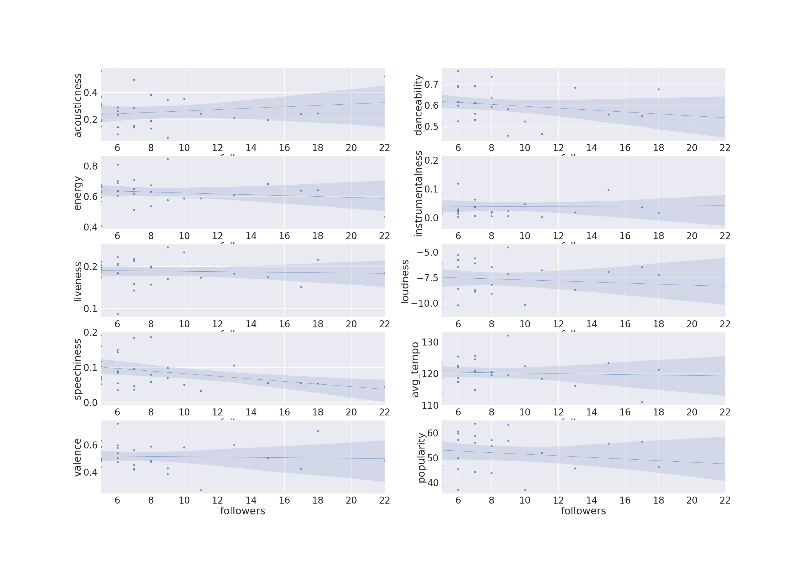

# What Makes a Spotify Playlist Popular?
 
## Combining Spotify Playlists with Artist Features
*Capstone I Project for Galvanize Data Science Immersive, Week 4*
 
*A Project by Luke Schroder*
## Learning Objectives
- Learn how to work with pyspark for big data analysis
- Practice SQL querying in sparkSQL
- Practice EDA
## Table of Contents
- [Introduction](#Introduction)   
   - [Background and Overview](#background-and-overview)
   - [The Question](#the-question)
   - [The Data](#the-data)
- [Exploratory Data Analysis](#exploratory-data-analysis)
   - [Addressing the Join](#addressing-the-join)
   - [Missing Data in the Joined Data Set](#missing-data-in-the-joined-data-set)
   - [Additional Notes on Data Cleaning](#additional-notes-on-data-cleaning)
   - [Distribution of Features by Artist](#distribution-of-features-by-artist)
   - [Who Are the Top Artists, What are their Features](#who-are-the-top-artists,-what-are-their-features)
- [What Makes for a Popular Playlist?](#what-makes-for-a-popular-playlist)
   - [Correlation Between Features and Playlist Popularity](#correlation-between-features-and-playlist-popularity)
- [Conclusion](#conclusion)
   - [Summary](#summary)
   - [Next Steps](#next-steps)
 
# Introduction
## Background and Overview
Since the advent of music streaming services at the turn of the millenium people have been intaking more songs than ever. One of the popular forms of music organization is the playlist, when a user creates a list of songs in their own collection. I've always been fascinated by the sharing of music and what makes a 'mixtape' popular.
 
For this project I wanted to see how a playlist gains popularity based on the types of sounds present in that playlist.
 
## The Question
Are certain artists more likely to be seen in popular playlists? If the artists making up a playlist are more danceable/happy/faster will that playlist be more popular?
 
## The Data
To gain insights into these questions I will be looking at the conjuctions of two datasets:
  
- [The Spotify Million Playlist Challenge Dataset](https://www.aicrowd.com/challenges/spotify-million-playlist-dataset-challenge)
 
- [Audio features of 175k+ songs released in between 1921 and 2021 Gathered from the Spotify Web API](https://www.kaggle.com/yamaerenay/spotify-dataset-19212020-160k-tracks?select=data.csv)
 
The first of these sets contains information on playlists, number of followers and the tracks/artists contained in them, the next is a list of songs with features generated from the Spotify Web API. These features include sound descriptors such as tempo, valence(relative happiness), acousticness and many more ([see here](https://developer.spotify.com/documentation/web-api/reference/#object-audiofeaturesobject) for more details). For the purpose of this project I have decided to use a slice of the million playlist data so as to improve runtimes for my code.
 
# Data Cleaning & Exploratory Data Analysis
## Addressing the Join
As mentioned before I am looking at the conjunction of these two data sets in order to gain insights. I decided to use pyspark and sparkSQL to bring in the data and join these sets on artist name.
## Missing Data in the Joined Data Set
Because of the difference in size in the two datasets a fair amount of playlist data could not be matched to features. To mitigate this I decided to group the playlists by the artists they contained to match the most possible features. Lets take a look at the line counts of the data sets and their respective merged sets, note that there is a fair amount of difference between the feature
 
| Dataset                        | Line Count|
|------------------------------------|----|
| 1. Playlists           | 1000 |
| 2. Non-Unique artists in playlist (line count = # of tracks)         | 67503 |
| 3. Features by artist (kaggle set)             | 32539 |
| 4. Artists by playlist with features (joined 2+3)          | 56945 |
| 5. Playlist by average feature (line count = # of playlists) (aggregate of 4)        | 865 |
 
 
 
## Additional Notes on Data Cleaning
A large portion of data cleaning involved making the dataset joining process as smooth as possible, this included type casting to columns in pyspark as well as numerous separate SQL table creations for easy plotting. To see the full list of data importing and sparkSQL manipulation I highly encourage you to take a look at the [create dataframes notebook](notebooks/create_dataframes.ipynb).
 
Another piece of data cleaning that is important to mention is the fact that many artist names contain special character and formatting, to get around this issue I converted the artist names to raw strings prior to joining the data.
## Distribution of Features by Artist

 
Looking at the following chart we can see that instrumentalness (lack of lyrics) and speechiness(presence of spoken word speech-like recording) are very heavily distributed on the lower end of the possible range, this is likely due to the fact that most music has lyrics that are sung. Lets take a look at tempo and artist popularity.
 
 

 
Here we can see that there seems to be a relatively normal distribution of average tempo, this is likely due to the central limit theorem stating that when taking samples of means the distribution of these samples will be distributed normally. I also wanted to note that the popularity distribution appears to be skewed toward more popular artists, which would be an intuitive thought.
## Who Are the Top Artists, What are their Features

 
An interesting thing to note here is the relative similarity between the most represented artists in the data set.
 
# What Makes for a Popular Playlist?
## Correlation Between Features and Playlist Popularity

 
Something that I noticed here is the apparent negative correlation between dancability and playlist popularity. I wanted to run a hypothesis test to see if this is indeed the case. In the stats_test notebook you can see my methodology for creating a Mann-Whitney U-Test that compares features from "more popular" and "less popular" halves of the playlist data. I set an alpha value of 0.1 and found that the evidence is not significant enough to prove that more popular playlists contain less danceable songs at a p-value of 0.147. I tried this process on a number of other features  with hypotheses mirroring what I saw in the graphs above and could not find significant conclusions anywhere except for the decrease in speechiness contributing to a more popular playlist at a p-value of 0.034, this could be attributed to the fact that a majority of speechiness features in the artist dataset contained a low value. I attribute these outcomes to the fact that this is just based off of a slice of the playlist data which contained a very low number of followers. Another possibility to consider is that it is not only the features that lead to a playlist being more popular but rather the distribution of said features.
 
# Conclusion
## Summary
For the purpose of this project I wanted to focus on data manipulation and cleaning through the tools necessary when operating with big data sets, too large to be worked with through traditional data tools. To accomplish this I examined a conjunction of two spotify data sets of both user generated playlists and artist featuration provided by the spotify API. Through this project I was able to learn the tools necessary to clean and create pyspark dataframes and use sparkSQL to merge and manipulate them. Through exploratory data analysis I was able to gain insights into feature distributions across all artists as well as what those features looked like for some of the most frequently playlisted artists. From there I plotted correlation between individual features in popular playlists and ran U-tests on their relation to whether or not they helped a playlist become popular. In conclusion I found that the data set in its current state is not enough to prove that any individual feature other than speechiness will lead to a more popular playlist. I hope to work to build on this project and import more data into it in the future.
 
## Next Steps
- With a few tweaks to the code I will be able to bring in song and genre level data
- Create spotify web API applet to bring in full track feature data
- Look into correlation between distributions of features in joined dataset